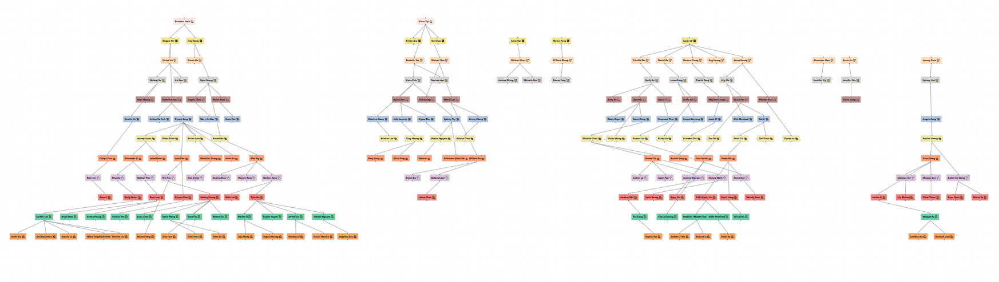
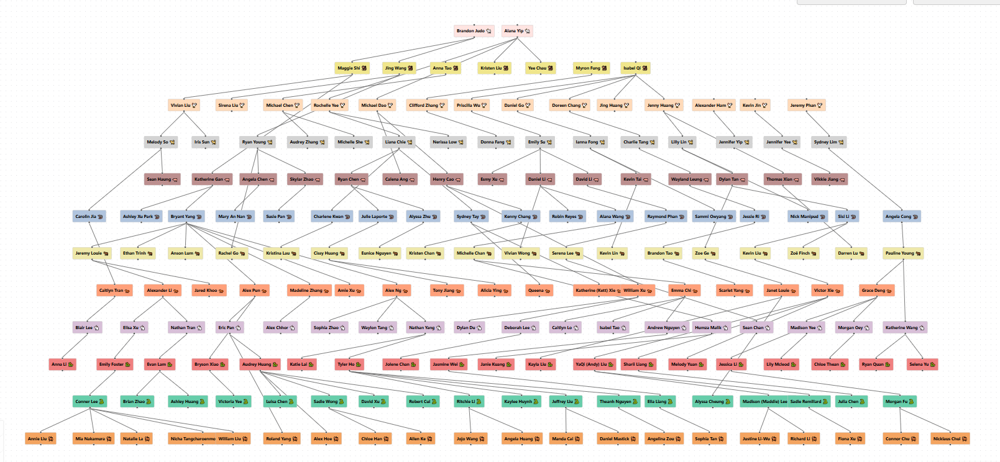

# Association of Chinese Americans at UCLA Family Tree

Interactive family tree visualization for the Association of Chinese Americans at UCLA's Staff lines.

Built using react-flow.




## Get Started

You may use the website normally https://aca-family-tree.vercel.app/

To run it locally clone the repository
```
git clone https://github.com/rolandyangg/aca-family-tree.git
```

Install the necessary dependencies, then run a local server.
```
npm install
npm run dev
```

## How To Modify

All of the family data is stored in the file `data.js`

Each staff year is in a different dictionary. Each dictionary is filled in the format
```
const YEAR = {
    "STAFFER_1": ["KID_1", "KID_2", "KID_3", ...],
    "STAFFER_2": [] // Had no kids that made it onto staff LOL
    ...
}
```

In order for the new year to be added, it must be appended to the end of the `DATA` array at the bottom of the file. The order of years in that array dictates the order they are outputted.

In the tree, people who did Exec are notated by an extra emoji in their name with the zodiac year that they did Exec. For the extra emoji to be added to their name, you must put their full name in the corresponding emoji dictionary in `EXEC` in the `data.js` file.

```
const EXEC = {
    ...
    "🐎": ["EXEC_1", "EXEC_2", ...]
    ...
}
```

All coloring data and emoji data for each staff year, if you want to change it, can be found in `constants.js`

Have fun!

- Roland Yang (Sponsorships Chair, Horse '25)
